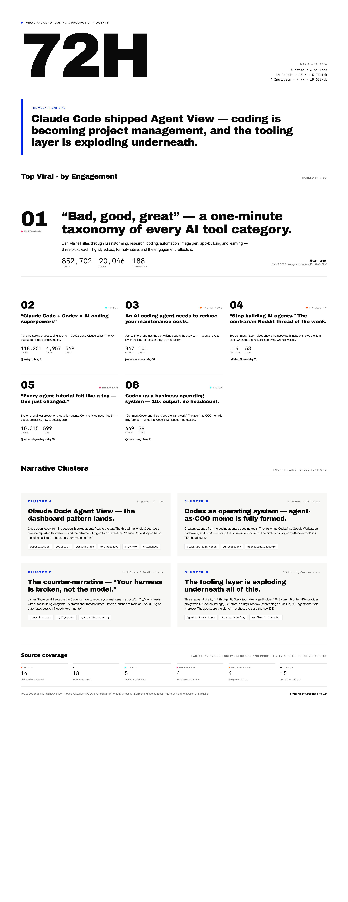

# /last72hours

A Claude Code skill that runs a **72-hour viral radar** across Reddit, X, TikTok, Instagram, Hacker News, YouTube, and GitHub — then renders an editorial-scorecard leaderboard in [Paper.design](https://paper.design) via its MCP server.

```
/last72hours AI coding agents
/last72hours nvidia earnings
/last72hours kanye west
```

## Example output

`/last72hours AI coding and productivity agents` (run 2026-05-11, 60 items across 6 sources in 110 s):



**[→ Live HTML version with clickable links](https://htmlpreview.github.io/?https://github.com/iharnoor/last72hours-skill/blob/main/examples/ai-coding-agents-72h-radar.html)** · or [view source](examples/ai-coding-agents-72h-radar.html)

## What you get

1. A 72-hour scrape of the topic across 7 sources, saved as Markdown
2. A **self-contained HTML mirror** with every source as a clickable link — shareable in Slack/email/DMs
3. (Optional, if Paper Desktop is running) an auto-built Paper.design artboard mirroring the HTML
4. A 2× PNG export from Paper

## Install

This skill **wraps** [`mvanhorn/last30days-skill`](https://github.com/mvanhorn/last30days-skill). Install that first.

```bash
# 1. Install the upstream engine
git clone https://github.com/mvanhorn/last30days-skill ~/.last30days-skill
ln -s ~/.last30days-skill/skills/last30days ~/.claude/skills/last30days

# 2. Install this skill
git clone https://github.com/iharnoor/last72hours-skill ~/.last72hours-skill
ln -s ~/.last72hours-skill/skills/last72hours ~/.claude/skills/last72hours

# 3. (Optional) Install Paper Desktop for the visualization step
#    https://paper.design
claude mcp add paper --transport http http://127.0.0.1:29979/mcp --scope user
```

## Configuration

Set up an `.env` somewhere on disk (the skill will look in `$LAST72_ENV` first, then `$PWD/.env`):

```bash
# Required for IG / TikTok (paid, 10K free trial credits at scrapecreators.com)
SCRAPECREATORS_API_KEY=sk_...

# Required for X (option 1: browser cookies, free)
AUTH_TOKEN=...
CT0=...

# Required for X (option 2: xAI API, paid)
# XAI_API_KEY=xai-...

# Optional Bluesky
# BSKY_HANDLE=...
# BSKY_APP_PASSWORD=...
```

Free sources (no key): Reddit, Hacker News, YouTube (via `yt-dlp`), GitHub, Polymarket.

## Usage

```
/last72hours <topic>
```

The skill will:
1. Run the `last30days` engine with `--days=3`
2. Save the raw scrape to `$LAST72_OUTPUT_DIR` (defaults to `~/Documents/Last72Hours`)
3. If Paper Desktop is running with a document open, drive Paper MCP to build the leaderboard
4. Export a 2× PNG of the artboard

## Credits

Built on top of [`/last30days`](https://github.com/mvanhorn/last30days-skill) by Matt Van Horn.

MIT.
